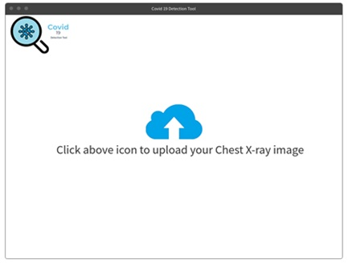

# CSE6250 -Team 27 COVID-19 Detection with X-ray Image Classification Using Cloud Computing Platforms 

A graduate-course project on developing novel methods of classifying X-ray images of patients using Deep Learning Pipelines (DLP) processing techniques such as the PyTorch and Spark Machine Learning Library (MLlib) in Amazon Web Services and DataBricks

By Anh Tran, Fathima Thotathil and Ron He

## Project Description:

Chest X-ray is a fast and effective diagnostic method for COVID-19 detection. Using chest X-ray images, several artificial intelligence (AI) techniques that use deep learning models have been proposed and built to automatically detect COVID-19.

Using the deep learning technique such as Convolutional Neural Network (CNN), in our project, we used both PyTorch and PySpark frameworks with two pretrained models (i.e. ResNet50 and InceptionV3) for binary classification (COVID vs. No-findings) and multi-class classification (COVID vs. No-findings vs. Pneumonia) settings.

We observed improvements in the accuracy and performance over some of the current techniques for performing binary and multi-class classifications on X-ray Images. Specifically, our ResNet-50 PyTorch model and Resnet50 and Logistic Regression PySpark model achieved very high accuracy (90% or more) for both classification tasks. Furthermore, we managed to host the model in AWS and diagnose the outcome based on the uploaded X-ray images.

## Dataset:

We combined three X-Ray image datasets  from Cohen JP et al., Ozturk et al., and Chowdhury et al. studies that are publicly available. Below are their links:

https://github.com/ieee8023/covid-chestxray-dataset

https://github.com/muhammedtalo/COVID-19

https://github.com/tawsifur/COVID-19-Chest-X-ray-Detection

## Deep Learning Pipelines (DLP) Model Building:
The entire project development cycles were divided into two stages. Feature Engineering using CNN and Model Training.

For PyTorch Model Training, the pretrained ResNet-50 and InceptionV3 were used. See PyTorch folder for the notebooks.

For Pyspark Model Training, the last layers were build using three models. See PySpark folder for the notebooks.
1.  Logistic Regression.
2.  Random Forest.
3.  Decision Tree.

## DataBricks Set-up for Pyspark Notebook:
1.  Launch a Python 3 cluster running Databricks Runtime 5.5 LTS ML.
2.  Add spark-deep-learning library with the Maven and Coordinate 1.4.0-spark2.4-s_2.11.
3.  Add Libraries with the Source option PyPI and Package tensorflow==1.12.0, keras==2.2.4, h5py==2.7.0, and wrapt.

## High Level Architecture:

We used Amazon SageMaker’s GPU powered integrated Jupyter authoring notebook instance to build and train both ResNet-50 and InceptionV3 models using custom Pytorch code . Since the ResNet-50 model performed better than the InceptionV3 model, we chose to host the ResNet-50 model using SageMaker hosting services to provide inferences. We used Amazon SageMaker Neo to compile and deploy the trained model on a GPU powered real time inference instance. We used Amazon Simple Storage Service (S3) to store the dataset to train the model , the best trained model and the SageMaker Neo compiled model. 

In order to allow the hosted model to be accessible from external applications, we integrated the hosted model with an Internet facing REST API built using Amazon API Gateway and Amazon Lambda function written in Python. API Gateway acts as the ‘front door’ to our serverless frontend web application built in React using AWS Amplify. The front end client application is a single page web application which provides users the ability to upload their Chest X-ray image. After a user uploads the image, the request is sent to the POST API hosted on API Gateway which then triggers the Lambda function. Then the Lambda function in turn forwards the request to the hosted model. The hosted model then provides the inference back to the Lambda function which is then forwarded to the API Gateway and finally to the client application. See below high level architecture diagram and the client app wireframes. 

